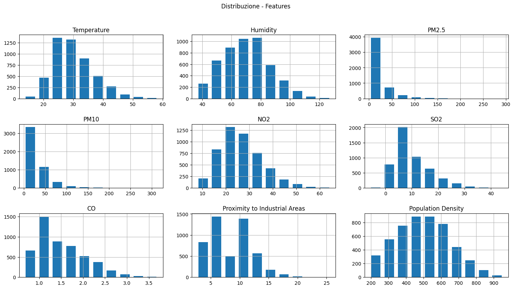
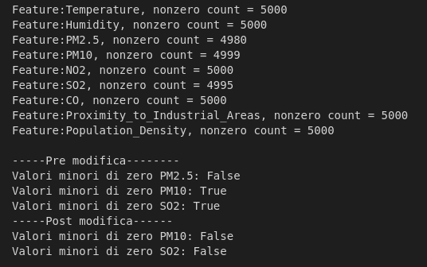
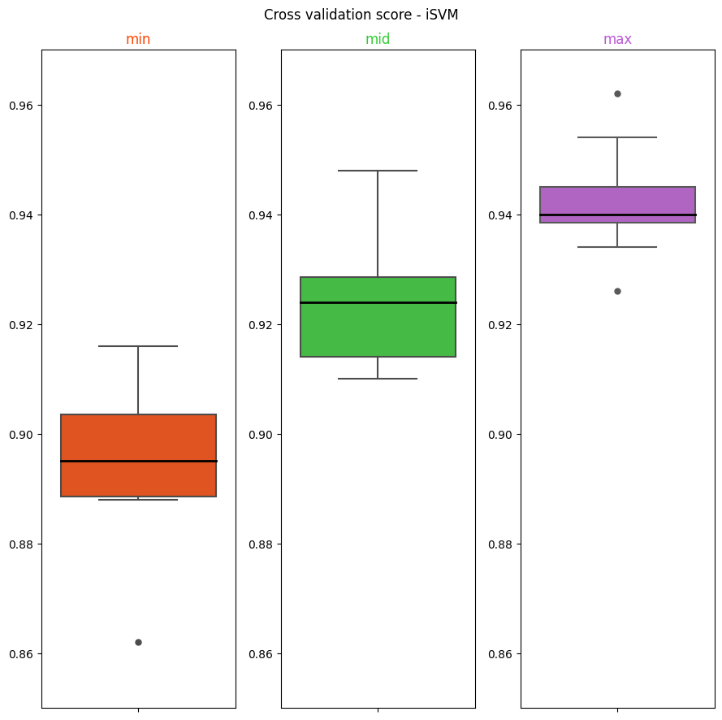

# Air Quality and Pollution Assessment

## Introduzione

Il dataset preso in considerazione (https://www.kaggle.com/datasets/mujtabamatin/air-quality-and-pollution-assessment) si concentra sulla predizione della qualità dell'aria attraverso diverse regioni, basandosi su una serie di fattori demografici ed ambientali.

L'obiettivo del lavoro svolto dal gruppo è stato di analizzare diversi algoritmi di predizione multi-classe e confrontare i risultati ottenuti sulla predizione. In particolar modo sono stati selezionati 3 principali algoritmi da allenare e valutare:

- *Decision tree*
- *Random forest*
- *Support Vector Machine*

## Analisi del dataset

Il dataset è composto da 5000 records, ognuno caratterizzato da 9 key features ed una classe attribuibile fra 4 possibili. Nello specifico le features presenti sono:

- *Temperature* (°C): Temperatura media della regione presa in considerazione
- *Humidity* (%): Umidità relativa della regione
- *PM2.5* (µg/m³): Concentrazione di polveri sottili nell'aria 
- *PM10* (µg/m³): Concentrazione di polveri totali sospese nell'aria
- *NO~2~* (ppb): Livello di concentrazione di diossido di azoto
- *SO~2~* (ppb): Livello di concentrazione di diossido di zolfo
- *CO* (ppm): Livello di concentrazione di monossido di carbonio
- *Proximity to Industrial Areas* (km): Distanza dalla zona industriale più vicina
- *Population density* (people/km^2^): Densità di popolazione per chilometro quadrato

Mentre il target è *Air Quality* con 4 possibili valori:

- *Good*: Aria pulita con un basso livello di inquinamento
- *Moderate*: Aria con qualità accettabile ma con presenza di alcuni agenti inquinanti
- *Poor*: Aria di cattiva qualità con un notevole inquinamento che potrebbe causare problemi di salute in soggetti sensibili
- *Hazardous*: Aria di pessima qualità con un estremo inquinamento che potrebbe causare problemi di salute in tutta la popolazione

Osservando nello specifico il dataset si può notare come tutti e 5000 i records siano completi, senza valori mancanti. Le features, inoltre, sono tutte di tipo continuo.

### Analisi Features

Andando ad osservare la distribuzione delle features risulta immediatamente interessante la distribuzione della *proximity*. Essa ha un andamento simile ad una bimodale, con un picco a 5 ed uno a 10 chilometri. Questo comportamento può indicare una suddivisione in cluster distinti dei dati, andando ad individuare una possibile superficie di separazione.

In seguito è stata analizzata la correlazione fra le features, andando ad individuare il rapporto di crescita fra di esse.  Dalla heatmap della correlazione è utile evidenziare tre situazioni:

- La concentrazione di PM2.5 e PM10 sono altamente correlate e questo sottolinea la possibilità di eliminare una delle due features senza perdita significativa di informazioni
- La vicinanza alle zone industriali è fortemente correlata negativamente con tutte le altre features e questo sottolinea il contenuto informativo espresso da questa feature
- La concentrazione di NO~2~ , SO~2~ e CO sono abbastanza correlate e questo sottolinea un'ulteriore possibile aggregazione delle features

### Analisi classi

In seguito è seguita un'analisi dei records includendo la classe assegnata per verificare la bontà del dataset. Per visualizzare in modo migliore i dati la classe è stata modificata per renderla ordinale, dalla qualità migliore alla peggiore.

Osservando la distribuzione delle classi assegnate si può notare uno sbilanciamento dei records con una preponderanza della classe *Good*. 

### Analisi features e classi

Per evidenziare possibili problematiche legate alla distribuzione delle classi target si è verificato come le features del dataset influenzino la classe di appartenenza del record. I risultati più significativi ottenuti sono:

- Alta correlazione fra presenza di particolato, sia PM2.5 che PM10, ed una cattiva qualità dell'aria: nessun record della classe *Good* ha PM > 100 e lo spread dei valori di questa classe è molto limitato 
- Alta correlazione fra la densità di CO e la qualità dell'aria: i record della classe *Good* hanno uno spread di valori molto ridotto con valori di CO < 1.5
- Alta correlazione inversa fra la vicinanza ad aree industriali e la qualità dell'aria: nessun record della classe *Good* ha Proximity < 10 e, nonostante la presenza di alcuni outliers nelle altre categorie, queste hanno comunque una media di distanza dalle aree industriali significativamente inferiore rispetto alla classe *Good* 

Di conseguenza si può affermare che, nonostante il forte sbilanciamento verso records di classe *Good*, la separazione abbastanza netta fornita dalla caratterizzazione delle features del dataset permetterà di eseguire un training efficace.

Proseguendo nell'analisi dei dati si è scelto di visualizzare la disposizione delle classi nello spazio delle features per individuare ulteriori trend dei dati in modo più esplicito.

Il primo grafico rappresenta la relazione fra densità di popolazione (asse y), vicinanza a zone industriali (asse x), temperatura (grandezza dei punti) e qualità dell'aria. Da questa rappresentazione risulta ancora più evidente l'impatto della distanza delle zone industriali nella qualità dell'aria, con due principali scalini uno a 5 km ed uno a 10 km. Dal disegno si nota inoltre come, in media, le regioni più inquinate siano quelle con alta densità di popolazione evidenziando la possibile influenza della presenza di un numero maggiore di persone rispetto all'inquinamento dell'aria. 

Il secondo grafico rappresenta la relazione fra le densità dei tre elementi inquinanti reciprocamente e la qualità dell'aria.  Come già visto nell'analisi della correlazione delle features, i tre inquinanti seguono un andamento direttamente proporzionale fra di loro mentre la qualità dell'aria risulta inversamente proporzionale ad essi. In particolar modo nel grafo "NO2-CO" si può notare una separazione abbastanza netta delle 4 classi con fenomeni importanti di overlapping solamente nelle classi *Poor* e *Hazardous*.  

Aggiungendo al grafo "NO2-CO" un'ulteriore dimensione, filtrando per vicinanza alle zone industriali, si può valutare in modo migliore l'impatto della distanza su qualità dell'aria e presenza di sostanze inquinanti. 

## Preprocessing e feature selection

### Preprocessing

Dalla prima analisi del dataset era già emerso l'assenza di records con valori mancanti e di conseguenza non è necessario agire per correggere questa tipologia di errore nel dataset. Per quanto riguarda, invece, i valori assunti dalla features sono stati verificati che fossero tutti compatibili con la caratteristica espressa dalla feature. In particolar modo sono stati rilevati records con PM10 < 0 e SO2 < 0 e questi valori risultano sbagliati in quanto una concentrazione può essere al minimo 0. Di conseguenza tutti i valori incorretti sono stati modificati in 0. 

### Feature Selection

Per eseguire il training sono stati scelti 3 subsets delle features in base ai risultati ottenuti dalle analisi precedenti:

- *min* ["CO", "NO2", "Proximity_to_Industrial_Areas"]: Subset minimo, creato utilizzando solamente 3 delle features. In particolare contiene le features considerate a più alto contenuto informativo
- *mid* ["CO", "NO2", "Proximity_to_Industrial_Areas", "SO2", "Temperature"]: Subset di media grandezza composto dal subset minimo aggiunto delle features "SO2" e "Temperature"
- *max*: set completo di tutte le features del dataset

## Albero di decisione

### Parametri

Per selezionare i parametri migliori da utilizzare nel training sono state eseguite 3 GridSearch, una per ogni subset di features. Nello specifico sono stati utilizzati:

- *criterion* [Gini, logloss, entropy] : Criterio utilizzato per lo split
- *splitter* [best, random] : Strategia di scelta dello split
- *max depth* [3,5,7,9,15,20, None] 
- *min samples Split* [2, 5, 10, 50, 100, 250]

Inoltre ogni GridSearch è stata valutata con una 5-fold cross validation.

#### Min Tree

Per quanto riguarda il decision tree sul subset minimo i parametri migliori sono risultati: 

- criterion: entropy
- splitter: best
- max depth: 7
- min samples split: 50

#### Mid  Tree

Per quanto riguarda il decision tree sul subset di media grandezza i parametri migliori sono risultati: 

- criterion: Gini
- splitter: best
- max depth: 9
- min samples split: 10

#### Max Tree

Per quanto riguarda il decision tree sul set completo i parametri migliori sono risultati: 

- criterion: Gini
- splitter: best
- max depth: 20
- min samples split: 10

#### Evoluzione dei parametri

Visualizzando come i parametri si siano modificati con il cambio di features utilizzate è interessante notare come il numero di elementi per effettuare lo split di un nodo sia diminuito drasticamente mentre la profondità è cresciuta. 

### Analisi risultati

Una volta allenati i tre decision trees differenti è possibile confrontare i risultati ottenuti. Per farlo è stato scelto di rappresentare le confusion matrix delle predizioni effettuate dagli alberi ed il classification report. Come emerge dai dati le classi "Hazardous" e "Poor" sono quelle più confuse da tutti e 3 gli alberi anche se si assiste ad un notevole miglioramento nel caso *max*. In particolar modo i risultati più significativi sono:

- Notevole aumento del recall sulla classe "Hazardous" (0.73 -> 0.79) e aumento precision sulla classe "Poor" (0.75 -> 0.78): Incremento significativo di classi incorrettamente classificate "Poor" invece che "Hazardous"

- Nonostante la diminuzione in numero assoluto di records classificati correttamente "Poor" si può notare un aumento generale dell'accuracy dei modelli anche se minimo

Questi risultati sono stati poi confermati visualizzando il confronto fra gli score ottenuti dai 3 alberi durante la fase di cross validation. Nel grafico infatti si può notare un aumento dell'accuracy del modello con uno spread di valori nel caso *max* abbastanza inferiore rispetto agli altri. 

Infine è stata verificata l'importanza delle features osservando come essa cambiasse per ognuno dei tre modelli. Come è possibile notare la feature "CO" è risultata la più significativa nella costruzione del modello con "Proximity" a seguire come seconda per importanza.  La scelta delle features da inserire nei tre diversi subset risulta azzeccata, con "SO2" e "Temperature" che risultano più importanti per la creazione del modello rispetto alle altre features.

## Random Forest

### Parametri

Anche in questo caso il primo passo è stato effettuare una GridSearch per ottenere i parametri migliori. La ricerca è stata effettuata sui parametri: 

- *criterion* [Gini, logloss, entropy]: Criterio utilizzato per lo split
- *n_estimators* [2, 5, 10, 25, 50, 100]: Numero di alberi nella foresta
- *max depth* [3,5,7,9,15,20, None] 
- *min samples Split* [2, 5, 10, 50, 100, 250]

Inoltre ogni GridSearch è stata valutata con una 5-fold cross validation.

#### Min Forest

Per quanto riguarda la forest sul subset minimo i parametri migliori sono risultati: 

- criterion: Gini
- n_estimators: 50
- max depth: 9
- min samples split: 10

#### Mid  Forest

Per quanto riguarda la forest sul subset di media grandezza i parametri migliori sono risultati: 

- criterion: Gini
- n_estimators: 50
- max depth: 9
- min samples split: 10

#### Max Forest

Per quanto riguarda la forest sul set completo i parametri migliori sono risultati: 

- criterion: entropy
- n_estimators: 50
- max depth: 15
- min samples split: 5

#### Evoluzione dei parametri

Visualizzando come i parametri si siano modificati con il cambio di features utilizzate è interessante notare come il numero di elementi per effettuare lo split di un nodo sia diminuito  mentre la profondità è cresciuta, similmente a quanto accaduto con gli alberi di decisione. E' possibile notare inoltre come il numero di alberi presenti nella forest sia sempre risultato uguale, indipendentemente dal subset di features utilizzato. 

### Analisi risultati

Sono state rappresentate le confusion matrix delle predizioni effettuate ed il classification report. Come per gli alberi di decisione le classi "Hazardous" e "Poor" sono quelle più confuse ma vi è un notevole miglioramento rispetto ai modelli precedenti. In particolar modo i risultati più significativi sono:

- Notevole aumento della precision sulla classe "Poor" (0.79 -> 0.85) e aumento precision sulla classe "Hazardous" (0.83 -> 0.90): Incremento significativo delle classificazioni corrette di "Poor", diminuendo i falsi positivi appartenenti alla classe "Hazardous" e "Moderate"

Questi risultati sono stati poi confermati visualizzando il confronto fra gli score ottenuti dalle 3 forests durante la fase di cross validation. Come per gli alberi di decisione, all'aumentare della grandezza del set di features, oltre ad un aumento dell'accuracy vi è una diminuzione graduale dello spread di quest'ultima. 

Dall'analisi dell'importanza delle features si può notare come "Proximity" e "CO" risultino nuovamente quelle ad impatto maggiore sul modello, con una differenza fra le due abbastanza ridotta. In generale tutte le features, ad esclusione di PM2.5 e PM10, hanno un'importanza piuttosto significativa sulle predizioni effettuate da tutti i modelli.  

## SVM - One Versus Rest

### Parametri

Per quanto riguarda i parametri dei classificatori di tipo support vector 

La ricerca dei parametri si è focalizzata su: 

- *C* [0.01,0.1,1.0,10.0,50.0]: Parametro di regolarizzazione per i support vector 
- *gamma* [0.0001, 0.001, 0.01, 0.1, 1.0, 5.0]: Parametro che può essere visto come l'inverso del raggi di influenza dei support vector

Inoltre ogni GridSearch è stata valutata con una 5-fold cross validation.

#### Min SVM _OVR

Per quanto riguarda SVM sul subset minimo i parametri migliori sono risultati: 

- C: 10
- gamma: 1

#### Mid  SVM_OVR

Per quanto riguarda SVM sul subset di media grandezza i parametri migliori sono risultati: 

- C: 50
- gamma: 0.1

#### Max SVM_OVR

Per quanto riguarda SVM sul set completo i parametri migliori sono risultati: 

- C: 50
- gamma: 0.01

#### Evoluzione dei parametri

All'aumento delle features corrisponde sia un aumento del valore di C che una diminuzione del valore di gamma. Per il valore di gamma è stata utilizzata una scala logaritmica sull'asse y. 

### Analisi dei risultati

Dalla rappresentazione delle confusion matrix delle predizioni effettuate ed il classification report risulta che le classi "Hazardous" e "Poor" sono quelle più confuse. In questo caso passare ad un set di features più grande per eseguire il training risulta in un miglioramento abbastanza significativo:

- Notevole aumento della precision sulla classe "Hazardous" (0.78 -> 0.85) e della precision della classe "Poor" (0.78 -> 0.75): I membri di entrambi le classi vengono riconosciuti in numero molto maggiore

Dalla valutazione del grafico sul cross validation score si può osservare il notevole aumento delle prestazioni dei modelli. 

Al contrario degli alberi di decisione e di random forest, nelle SVM create con un kernel non-lineare , non esiste un corrispettivo dell'importanza delle features. Questo poichè, lavorando in con queste tipologie di kernel, si perde l'associazione fra lo spazio delle features e lo spazio in cui viene eseguito il taglio di SVM. Di conseguenza i "pesi" assegnati in SVM non corrispondono direttamente ad una ipotetica importanza delle features. 

## SVM - One Versus One

E' stato effettuato anche uno studio su un classificatore SVM di tipo "One versus one" per effettuare la classificazione. I risultati ottenuti sono stati identici al classificatore della tipologia "One versus rest" utilizzata precedentemente. 

##  SVM Iterativa

Come ultima versione di SVM è stata pensata una versione iterativa del modello. Il modello così formato è composto da una serie di SVM ognuna allenata per individuare solamente una delle classificazione. Per effettuare una predizione su un record, esso "passa" attraverso la prima SVM e, se non appartiene alla prima classe, viene "passato" alla seconda e così fino alla corretta classificazione. 

### Parametri

Utilizzando SVM lineari all'interno della ricorsion, lo studio dei parametri è stato effettuato solo sul parametro C. Nello specifico abbiamo scelto di utilizzare la media sul cross validation score eseguito su 10 fold per effettuare la scelta dei parametri migliori. 

Range di valori di C: 

- Combinazioni di valori 0.001, 0.01, 0.1, 1 e 10 con aggiunta delle tuple [5,5,5], [25,25,25] e [50,50,50]

#### Min iSVM

Per quanto riguarda iSVC sul subset minimo il parametro migliore è risultato: 

- C = [0.1, 0.1, 1.0]

#### Mid iSVM 

Per quanto riguarda iSVC sul subset di media grandezza il parametro migliore è risultato: 

- C = [1.0, 0.1, 0.1]

#### Max iSVM 

Per quanto riguarda iSVC sul dataset completo il parametro migliore è risultato: 

- C = [0.1, 1.0, 0.1]

#### Evoluzione dei parametri

I valori assunti da C non sono variati per i 3 modelli allo stesso modo. Per il valore di C è stata utilizzata una scala logaritmica sull'asse y. 

### Analisi dei risultati

Dalla rappresentazione delle confusion matrix delle predizioni effettuate ed il classification report risulta che la classe "Poor" è quella più confusa ma, in questo caso, con la classe "Moderate". Passare ad un set di features più grande migliora in modo significativo il livello della classificazione:

- Notevole aumento della precision sulla classe "Poor" (0.69 -> 0.81) : Incremento significativo delle classificazioni corrette di "Poor", diminuendo i falsi positivi appartenenti alla classe "Hazardous" e "Moderate"
- Aumento della precision sulla classe "Hazardous" (0.74 -> 0.88) 

Infine sono rappresentati i grafici del cross validation score. Si può notare l'incremento significativo delle previsioni corrispondente all'aumento delle features inserite nel modello. 

## Confronto dei modelli

Come ultimo step sono stati selezionati i modelli più performanti per ognuna delle tipologie che sono state analizzate ed in seguito sono stati confrontati i risultati ottenuti. 

### Analisi dei risultati

Di seguito sono riportate le confusion matrix e i classification report dei 4 modelli migliori. I risultati più significativi sono:

- SVM risulta il più performante per quanto riguarda le classi "Good" e "Hazardous" con un totale di 17 errori di classificazione ed un F1-score di 1.0 e 0.87 rispettivamente sulle due classi
- Forest risulta invece il migliore per quanto riguarda la predizione delle classi "Moderate" e "Poor" con un F1-score di 0.96 e 0.87 rispettivamente
- In generale tutti i modelli hanno performato quasi perfettamente nell'assegnazione della classe "Good"

Osservando infine i punteggi ottenuti nella fase di cross validation si può osservare che in media la Forest sia il modello con le migliori prestazioni, con un'accuracy media più alta di un punto percentuale rispetto agli altri tre modelli ed uno spread di valori inferiore. 

